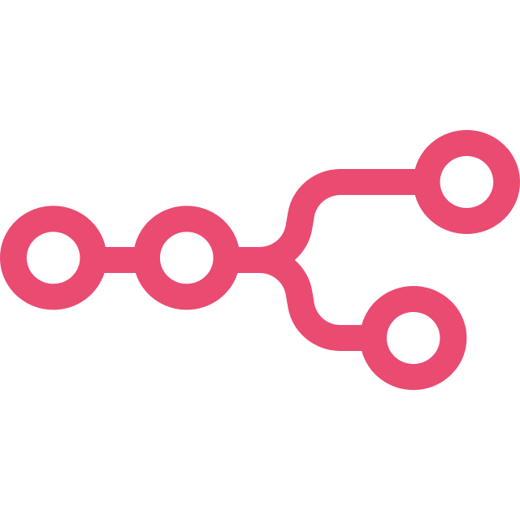
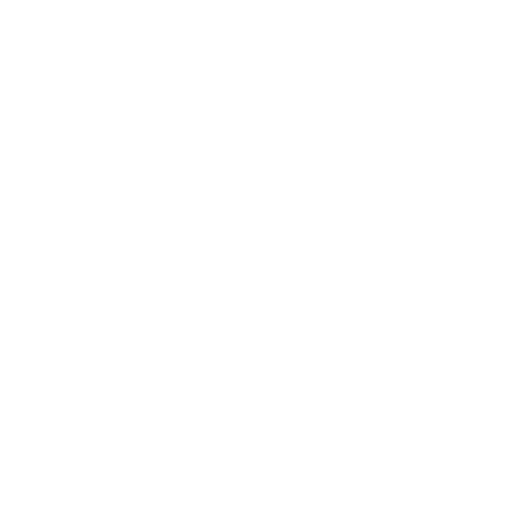
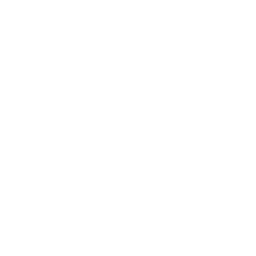
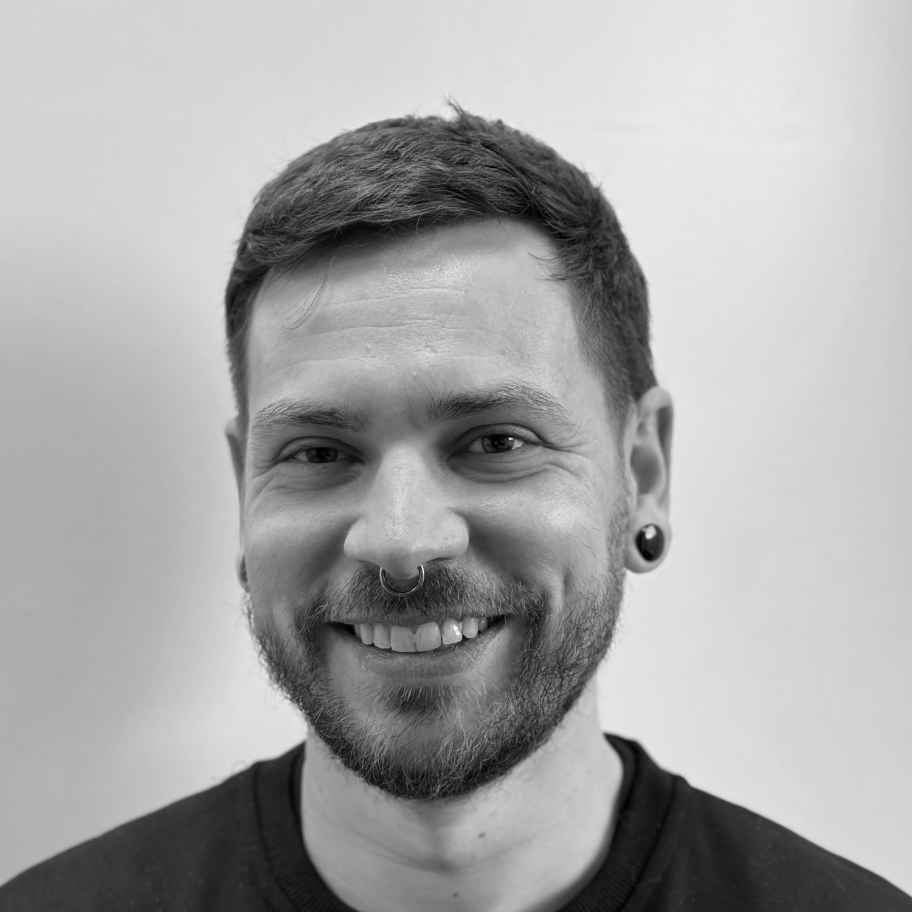
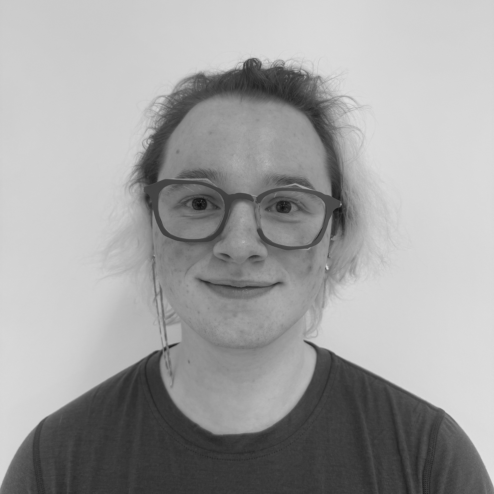
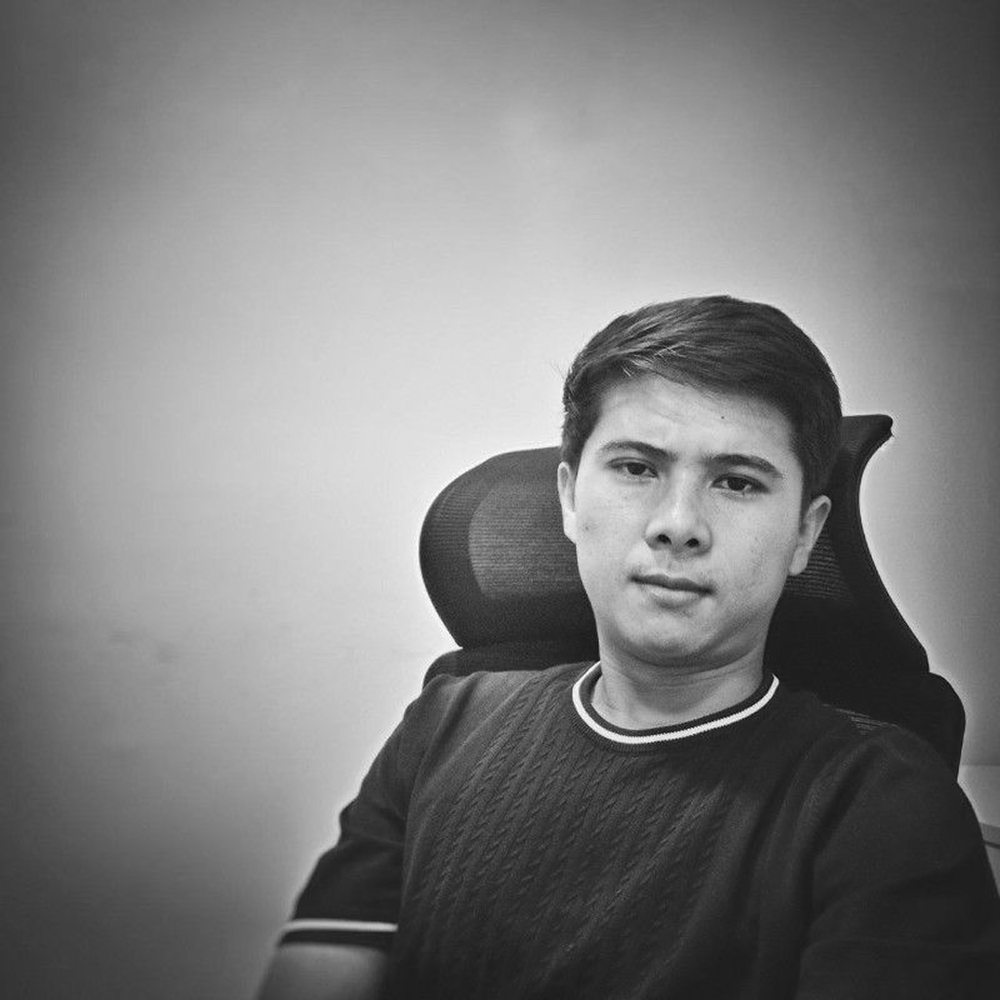

<!-- SLIDE 1: HERO -->

  

  

  

  
Hack4Innovation Bicocca · March 27, 2026

  <h1 class="hero-title"><em>HireLight</em></h1>

  

    Spot top talent at first glance. 
    Faster screening, clearer decisions, zero manual drag.
  

<!--
"Good evening everyone, my name is Andrea and today we will present **HireLight**, our AI solution to make hiring faster and smarter.
-->

---

<!-- SLIDE 2: THE PROBLEM -->

  

    The problem
    <h2 class="prob-title">CV screening is <em>broken</em></h2>
    
Recruiters lose hours every week on repetitive, subjective, unmeasurable tasks.

  

  

    

      
01

      
⏱️

      <h3>Manual and isolated management</h3>
      
CVs via email handled one by one, with no automation. Time grows, quality doesn't.

    

    

      
02

      
⚖️

      <h3>Subjective evaluations</h3>
      
No shared standard: bias and inconsistency in decisions, valid candidates excluded by mistake.

    

    

      
03

      
📊

      <h3>Zero KPI visibility</h3>
      
No data, no tracking. Without metrics the process cannot be measured — and cannot improve.

    

  

  

    

      
23h

      
per week spent on manual screening

      
Instant Impact Recruiting Report

    

    

    

      
40%

      
perceived inefficiency in the hiring process

      
PwC Annual Global CEO Survey

    

    

    

      
0 KPI

      
data visibility for 30% of companies

      
Modern Measures of Talent Acquisition

    

  

<!--
In fact Small and big companies have the same big problem: **hairing is slow.**

Recruiters lose hours every week on repetitive and  sabjektive tasks.
This can be a problem because it can lead to manual and isolated management,
sabjektive evaluation,
and ziro  KPI visibility.

 Just think that in a PwC report  the hairing prosess is considered inefficency in 40% of cases.
-->

---

<!-- SLIDE 3: THE SOLUTION — CONCEPT -->

  

    The solution
    <h2 class="prob-title">The <em>HireLight</em> Intelligence Layer</h2>
    
Transforming data into informed decisions, ethically and instantly.

  

  

    

      
01

      
🧩

      <h3>Multi-Feature Extraction</h3>
      
Hard skills, soft skills, and experiences are extracted to provide HR teams with deep, structured insights for <strong>informed decisions</strong>.

    

    

      
02

      
⚖️

      <h3>AI Act Compliant Scoring</h3>
      
Ethical meritocracy: the scoring model has access <strong>only to Experience and Education</strong> sections to ensure objective, bias-free evaluations.

    

    

      
03

      
⚡

      <h3>Active Intelligence</h3>
      
Unlike <strong>Traditional ATS</strong> (passive storage), HireLight proactively identifies talent and calculates fit in real-time.

    

  

  

    

      
-75%

      
Manual Screening Effort

      
LinkedIn Future of Work Report (2023)

    

    

    

      
100%

      
AI Act Transparency

    

    

    

      
AI-Powered

      
Vs Traditional ATS Silos

    

  

<!--
"Our solution is an **Intelligence Layer**.
1. We go beyond simple keywords: we extract multiple features—from hard skills to growth potential—so you can make **informed decisions**.
2. Ethics is at our core. We are **AI Act compliant**: our scoring model only looks at work experience and education to guarantee a bias-free, merit-based process.
3. While traditional ATS are passive silos, HireLight is **active intelligence**.
And the impact is real: according to LinkedIn, AI can reduce manual screening effort by 75%."
-->

---

<!-- SLIDE 4: TECHNICAL STACK -->

  

    Architecture
    <h2 class="prob-title">The <em>Engine</em> Under the Hood</h2>
    
A robust, modular, and cloud-native pipeline built for scale.

  

  
  

     <!-- Placeholder for a simple architecture diagram or icon set -->
     

        

           
28+

           
Interconnected Nodes

           
Parsing attachments, extracting multi-dimensional data, and orchestrating the candidate lifecycle.

        

        

           
Hybrid

           
Data Ingestion

           
Not only emails: native API integration with <strong>LinkedIn, Indeed, and corporate HR portals</strong>.

        

        

           
Jury

           
Model Intelligence

           
Supports <strong>Local LLMs</strong>, OpenAI APIs, or a <strong>Majority-Voting Jury</strong> of multiple models for unmatched reliability.

        

     

  

  

    

      
      
Automation

    

    

      
      
Intelligence

    

    

      
      
Database

    

    

      
      
Interface

    

  

<!--
"For the technical jury: the engine is modular and channel-agnostic. While we process emails out-of-the-box, the architecture supports direct API integration with 3rd-party portals. Finally, our Intelligence layer is model-agnostic: we can deploy local LLMs for privacy, or use a 'Jury of Models' with majority voting to guarantee objective and reliable scoring."
-->

---

<!-- SLIDE 5: GENERATED VALUE -->

  

    Impact
    <h2 class="prob-title">The <em>value</em> we create</h2>
    
Operational efficiency, standardization, and modularity without compromise.

  

  

    

      
10×

      
Efficiency

      
Full workflow automation from initial screening to final notification.

    

    

      
100%

      
Standard

      
Evaluation based on objective and certified parameters for every data batch.

    

    

      
0€

      
Maintenance

      
Cloud and no-code architecture that eliminates fixed server management costs.

    

    

      
100%

      
Modular

      
Agnostic workflow: choose the technology stack (ATS, CRM, HRIS) that fits best.

    

  

<!--
In this slide, we show the value of our pipeline.”

“ In fact The whole hairing  prosess is automated, from screening to final notification.”

“All candidates are evaluated using the same objective criteria.

” Thanks to cloud and no-code tools, there are no server costs to manage.”

and finally “Any tools can be used depending on the needs. The process is completely modular and can be adapted to your needs.
-->

---

<!-- SLIDE 6: BUSINESS MODEL & STRATEGY -->

  

    Strategy
    <h2 class="prob-title"><em>Business</em> Model</h2>
    
How we scale value in the HR Tech market.

  

  

    

      

        

          
💰

          

            <h3 style="color:#818cf8; font-size: 1.1rem; margin-bottom: 4px;">SaaS Subscription</h3>
            
Flexible monthly pricing based on managed volumes.

          

        

        

          
🎯

          

            <h3 style="color:#34d399; font-size: 1.1rem; margin-bottom: 4px;">Universal</h3>
            
Startup, SMB or enterprise: it works for everyone.

          

        

        

          
🚀

          

            <h3 style="color:#fbbf24; font-size: 1.1rem; margin-bottom: 4px;">Scalable Automation</h3>
            
Grows with you: from 10 to 10,000 applications with no changes.

          

        

      

    

  

<!--
"Our business plan is simple.
We offer a **monthly subscription**. Companies pay a small fee based on how many CVs they process.

It’s perfect for any size of company, from the largest to the smallest

And it grows with you, no matter how many applications you have, the resalt doesn’t change.

It’s a 'ready-to-go' system: you connect your email, and it starts working. No complicated setup needed."
-->

---

<!-- SLIDE 7: THE TEAM & ROLES -->

  

    The Team
    <h2 class="prob-title">Who <em>we are</em></h2>
    
Complementary skills for an innovative solution.

  

  

    

      

        
      

      

        <h3 class="team-name">Andrea Feliziani</h3>
        
UI/UX Designer & Front-end Developer

      

    

    

      

        
      

      

        <h3 class="team-name">Marco Cremaschi</h3>
        
Unimib Professor & Researcher

      

    

    

      

        
      

      

        <h3 class="team-name">Davide Vanoncini</h3>
        
Full-stack Developer & AI Specialist

      

    

    

      

        
      

      

        <h3 class="team-name">David Chieregato</h3>
        
Back-end Developer & AI Specialist

      

    

    

      

        
      

      

        <h3 class="team-name">Azizbek Gulomov</h3>
        
Front-end Designer

      

    

    

      

        
      

      

        <h3 class="team-name">Labhanshiv Jayan</h3>
        
Researcher

      

    

    

      

        
      

      

        <h3 class="team-name">Siraj Ahmed</h3>
        
Front-end Designer

      

    

  

<!--
in conclusion our team is made up of Andrea, Marco, Fabio, David, Azizbek, Labhanshiv, and Siraj.

we're done, thank you very much
-->

---

<!-- SLIDE 8: THANK YOU -->

  

  

    <h1 class="thankyou-title">Thank you.</h1>
    
Questions?

  

  

    📍 Bicocca
    📅 March 27, 2026
    🏆 @Hack4Innovation
  

