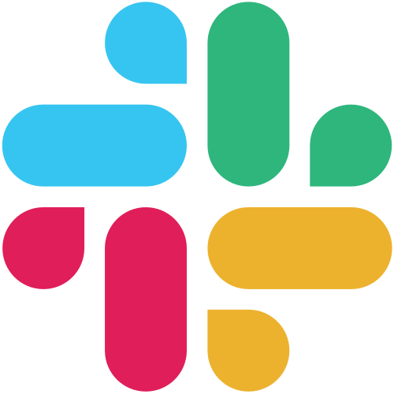
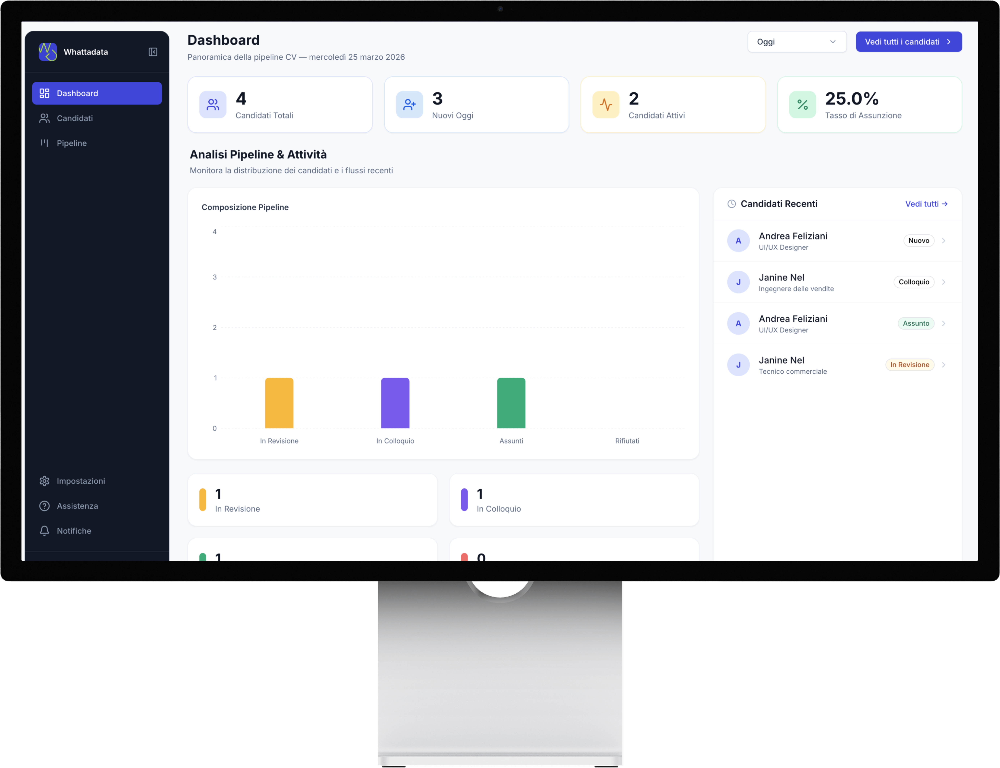
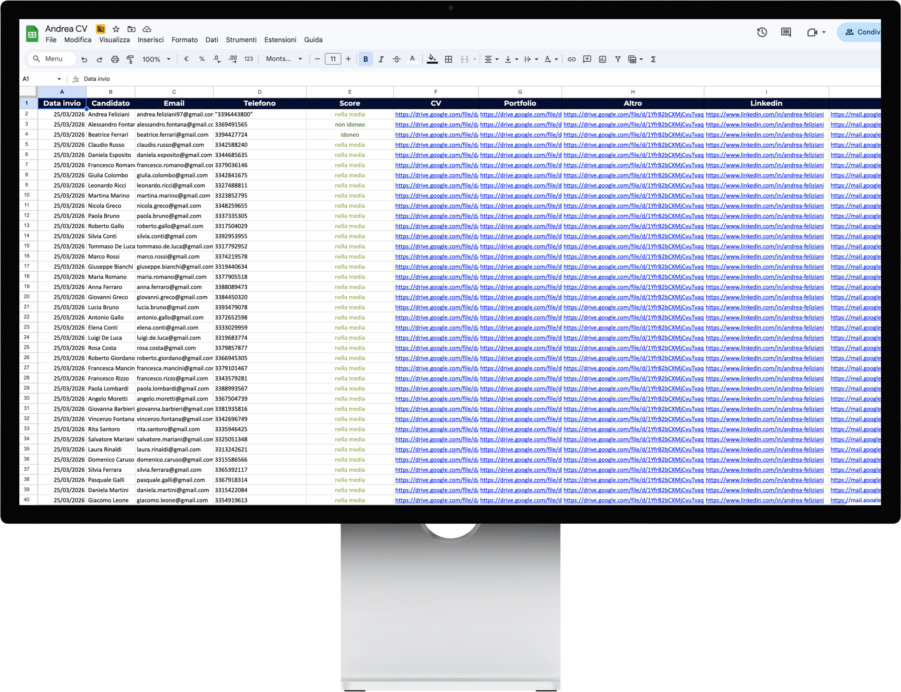

<!-- SLIDE 1: HERO -->

  
Hack4Innovation Bicocca · 27 Marzo 2026

  <h1 class="hero-title">Pipeline AI per la Talent Acquisition</h1>

  

    Da email a candidate scoring in pochi minuti. 
    Zero intervento manuale, dati strutturati, decisioni data-driven.
  

Scopri la Pipeline →

---

<!-- SLIDE 2: IL PROBLEMA -->

  

    Il problema
    <h2 class="prob-title">Lo screening CV è <em>rotto</em></h2>
    
I recruiter perdono ore ogni settimana su task ripetitivi, soggettivi, non misurabili.

  

  

    

      
01

      
⏱️

      <h3>Gestione manuale e isolata</h3>
      
CV via email gestiti uno per uno, senza automazione. Il tempo cresce, la qualità no.

    

    

      
02

      
⚖️

      <h3>Valutazioni soggettive</h3>
      
Nessuno standard condiviso: bias e inconsistenza nelle decisioni, candidati validi esclusi per errore.

    

    

      
03

      
📊

      <h3>Zero visibilità KPI</h3>
      
Nessun dato, nessun tracciamento. Senza metriche il processo non si misura — e non migliora.

    

  

  

    

      
23h

      
settimana dedicata allo screening manuale

      
Instant Impact Recruiting Report

    

    

    

      
40%

      
di inefficienza percepita nel processo di hiring

      
PwC Annual Global CEO Survey

    

    

    

      
0 KPI

      
visibilità sui dati per il 30% delle aziende

      
Modern Measures of Talent Acquisition

    

  

---

<!-- SLIDE 3: LA SOLUZIONE — PIPELINE -->

  

    La soluzione
    <h2 class="prob-title">Pipeline <em>automatizzata</em> end-to-end</h2>
    
Da email a candidate scoring in pochi minuti, zero intervento manuale.

  

  

    

      
01

      
📧

      <h3>Ingestion Email</h3>
      
Gmail trigger ogni 4h — scarica email con allegati non lette e le instrada nella pipeline.

    

    

      
02

      
📂

      <h3>Smart File Routing</h3>
      
Classificazione automatica → CV, Portfolio, Altro su Google Drive.

    

    

      
03

      
🤖

      <h3>AI Extraction + Scoring</h3>
      
GPT-5 estrae dati e valuta il CV su metriche personalizzate dall'azienda.

    

  

  

    

      
28

      
nodi n8n

    

    

    

      
      
n8n

    

    

    

      
      
OpenAI

    

    

    

      
      
Google Sheets

    

    

    

      
      
Slack

    

    

    

      
      
Next.js

    

  

---
clicks: 3
---

<!-- SLIDE 4: OUTPUT — DASHBOARD + EXCEL -->

  

    Output concreti
    <h2 class="prob-title"><em>Dashboard</em> & <em style="color:#34d399;">Report</em> strutturato</h2>
  

  

    

      

        

          
📊

          

            <h3 style="color:#818cf8;">Dashboard interattiva</h3>
            
Next.js + Supabase + Tailwind

          

        

        

          
<strong>KPI cards</strong> — totale candidati, nuovi oggi, tasso assunzione

          
<strong>Grafici pipeline</strong> — distribuzione per stato

          
<strong>Tabella candidati</strong> — ricerca, filtri, dettaglio

          
<strong>Filtri temporali</strong> — oggi, 7gg, 30gg, tutti

          
<strong>Pipeline Kanban</strong> — gestione visuale degli stati

        

      

      

        

          
📋

          

            <h3 style="color:#34d399;">Report Excel Strutturato</h3>
            
Google Sheets automation

          

        

        

          
<strong>Candidato</strong> — Mario Rossi

          
<strong>Score</strong> — Idoneo (58/70)

          
<strong>Ruolo dedotto</strong> — Content Creator

          
<strong>Email / Tel / LinkedIn</strong> — ✅ Estratti auto

          
<strong>CV / Portfolio</strong> — 🔗 Link Google Drive

        

      

    

    

      

        

          
📊

          

            <h3 style="color:#818cf8;">Dashboard interattiva</h3>
            
Visualizzazione dati in tempo reale

          

        

        

          
<strong>KPI cards</strong> — totale candidati, nuovi oggi, tasso assunzione

          
<strong>Grafici pipeline</strong> — distribuzione per stato

          
<strong>Tabella candidati</strong> — ricerca, filtri, dettaglio

          
<strong>Filtri temporali</strong> — oggi, 7gg, 30gg, tutti

          
<strong>Pipeline Kanban</strong> — gestione visuale degli stati

        

      

      

        
      

    

    

      

        

          
📋

          

            <h3 style="color:#34d399;">Report Strutturato</h3>
            
Database excel-like automatizzato

          

        

        

          
<strong>Candidato</strong> — Mario Rossi

          
<strong>Score</strong> — Idoneo (58/70)

          
<strong>Ruolo dedotto</strong> — Content Creator

          
<strong>Email / Tel / LinkedIn</strong> — ✅ Estratti auto

          
<strong>CV / Portfolio</strong> — 🔗 Link Google Drive

        

      

      

        
      

    

  

---

<!-- SLIDE 5: VALORE GENERATO -->

  

    Impatto
    <h2 class="prob-title">Il <em>valore</em> che creiamo</h2>
    
Efficienza operativa, standardizzazione e modularità senza compromessi.

  

  

    

      
10×

      
Efficienza

      
Automazione completa del workflow dallo screening iniziale alla notifica finale.

    

    

      
100%

      
Standard

      
Valutazione basata su parametri oggettivi e certificati per ogni lotto di dati.

    

    

      
0€

      
Manutenzione

      
Architettura cloud e no-code che azzera i costi fissi di gestione server.

    

    

      
100%

      
Modulare

      
Workflow agnostico: scegli lo stack tecnologico (ATS, CRM, HRIS) più adatto.

    

  

---

<!-- SLIDE 6: BUSINESS MODEL & POSIZIONAMENTO -->

  

    Strategia
    <h2 class="prob-title">Business <em style="color:#818cf8; text-shadow: 0 0 20px rgba(129,140,248,0.6);">Model</em> & <em style="color:#818cf8; text-shadow: 0 0 20px rgba(129,140,248,0.6);">Posizionamento</em></h2>
    
Come scaliamo il valore nel mercato HR Tech.

  

  

  

  

  

    

      

        
💰

        

          <h3 style="color:#818cf8; font-size: 1.2rem;">Business Model</h3>
          
SaaS & Performance based

        

      

      

        
<strong>Abbonamento SaaS</strong> — Tiered pricing mensile per volumi

        
<strong>Pay-per-Credit</strong> — Flessibilità per picchi stagionali

        
<strong>Enterprise API</strong> — One-time fee per setup custom

      

      

        

          
📈

          <h4 class="expanded-title">SaaS Tiered</h4>
          
Pricing mensile scalabile basato sui volumi gestiti.

        

        

          
💳

          <h4 class="expanded-title">Pay-per-Credit</h4>
          
Massima flessibilità per gestire picchi senza costi fissi.

        

        

          
🔌

          <h4 class="expanded-title">Enterprise API</h4>
          
Integrazione profonda e setup custom per workflow complessi.

        

      

    

    

      

        
🎯

        

          <h3 style="color:#34d399; font-size: 1.2rem;">Posizionamento</h3>
          
Strategicità & Integrazione

        

      

      

        
<strong>Target</strong> — HR Dept mid-large enterprise (Tech/Finance)

        
<strong>Differenziatore</strong> — No-code & AI vs Legacy Systems

        
<strong>Valore</strong> — Velocità 10x e scoring standardizzato

      

      

        

          
🏢

          <h4 class="expanded-title">Mid-Large Ent</h4>
          
Soluzione per dipartimenti HR in settori Tech e Finance.

        

        

          
🚀

          <h4 class="expanded-title">No-code & AI</h4>
          
La velocità dell'AI unita alla semplicità del no-code.

        

        

          
⚡

          <h4 class="expanded-title">Valore 10x</h4>
          
Screening più veloce e scoring oggettivo su ogni candidato.

        

      

    

  

---

<!-- SLIDE 7: GRAZIE -->

  <h1 class="thankyou-title">Grazie.</h1>

  

    Domande?
  

  

    📍 Bicocca
    📅 27 Marzo 2026
    🏆 Hack4Innovation
  

